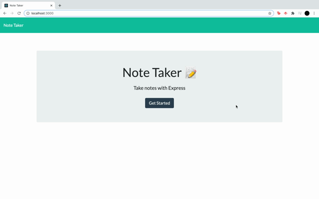

# notetaker
## Deployed Application Link
https://notetaker62.herokuapp.com/

## Table of Contents 

* [Demo](#demo)

* [Description](#description)

* [Installation](#installation)

* [Functionally](#functionally)

## Demo
 

## Description
This project is a Note Taker application. It allows you to take notes and save them. You're also able to delete notes.

## Installation
Clone to VS Code. Open a terminal and "npm install" to get the node modules. To run the appication type "node server.js". 

## Functionally
It allows the user to take and save notes. Used for studying or tasks.
